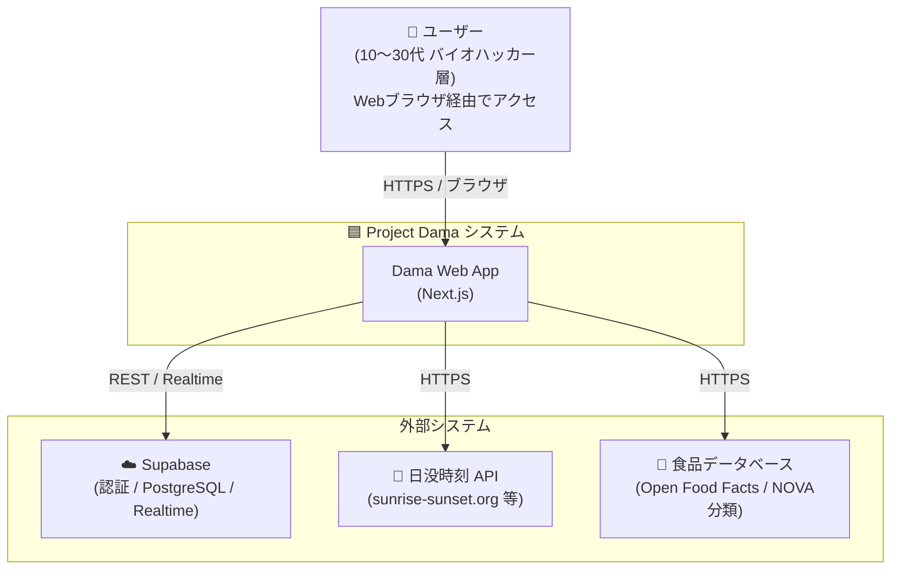
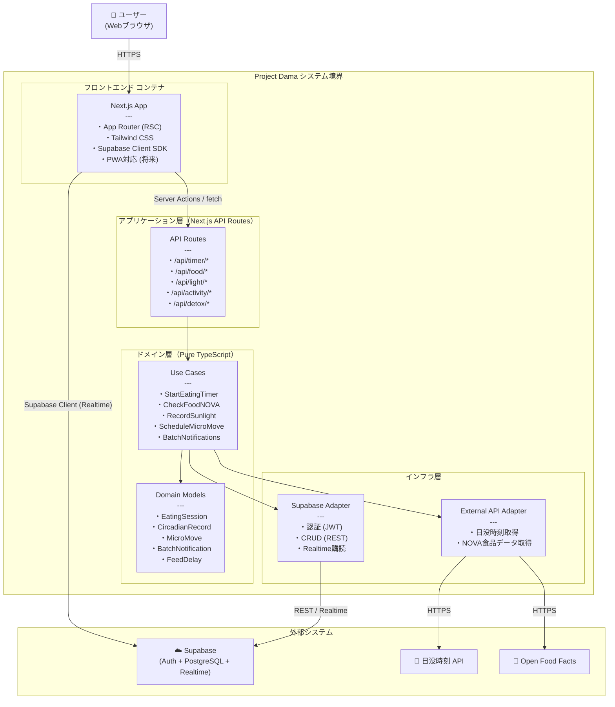
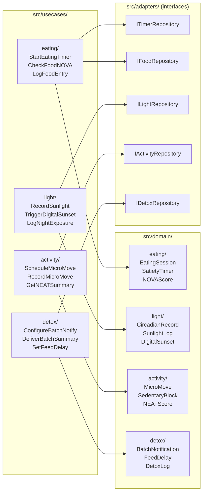

# C4 モデル — アーキテクチャ概要図
**ドキュメントID**: ARCH-C4-01  
**バージョン**: 1.0.0  
**作成日**: 2026-10-07  
**関連ADR**: [ADR-001](adr/ADR-001-clean-architecture.md), [ADR-002](adr/ADR-002-supabase.md), [ADR-003](adr/ADR-003-nextjs-frontend.md)

---

## Level 1：システムコンテキスト図（System Context Diagram）

システム全体とその外部要素との関係を示す。



---

## Level 2：コンテナ図（Container Diagram）

Damaシステム内部のコンテナ（デプロイ可能単位）とその関係を示す。



---

## Level 3：コンポーネント図（Component Diagram）— ドメイン層詳細

ドメイン層の内部構造と各ユースケースの依存関係を示す。



---

## 依存方向ルール（要約）

```
routes/pages → usecases → domain        ✅ OK
adapters → usecases → domain             ✅ OK
infrastructure → adapters                ✅ OK
domain → usecases                        ❌ NG（依存の逆転）
domain → infrastructure                  ❌ NG（外部依存）
usecases → infrastructure（直接）        ❌ NG（抽象化を挟む）
```

---

## 関連ドキュメント

- [ビジョン・スコープ定義書](../requirements/vision-scope.md)
- [ユーザーストーリー・受け入れ基準](../requirements/user-stories.yaml)
- [ADR-001: Clean Architecture 採用](adr/ADR-001-clean-architecture.md)
- [ADR-002: Supabase 採用](adr/ADR-002-supabase.md)
- [ADR-003: Next.js フロントエンド採用](adr/ADR-003-nextjs-frontend.md)
- [ADR-004: ディレクトリ構成](adr/ADR-004-directory-structure.md)

