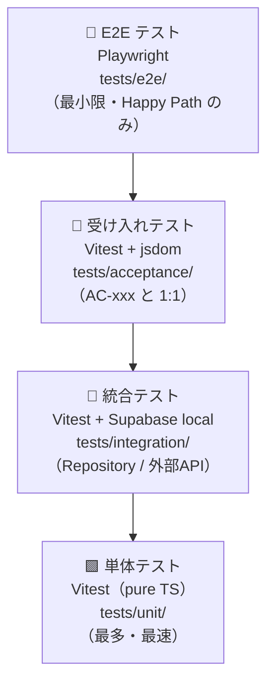

# テスト戦略
**ドキュメントID**: TEST-STRATEGY-01  
**バージョン**: 1.0.0  
**作成日**: 2026-10-07  
**関連スキル**: [test-strategy/SKILL.md](../../.github/skills/test-strategy/SKILL.md)  
**関連ADR**: [ADR-001](adr/ADR-001-clean-architecture.md)

---

## 1. 目的と原則

本プロジェクトのテスト戦略は以下の3原則を基盤とする。

1. **要件との1:1対応**: すべての受け入れテストは `AC-xxx` ID と対応し、要件変更時に同時更新する
2. **振る舞いの検証**: 実装詳細（クラス名・メソッド名）ではなく、**観測可能な振る舞い**を検証する
3. **Flaky ゼロ維持**: 時刻・乱数・外部APIはすべてスタブ化し、テスト結果を決定論的に保つ

---

## 2. テストピラミッドと配置



| レベル | フォルダ | ツール | 実行タイミング |
|---|---|---|---|
| Solo Unit（ドメイン） | `tests/unit/domain/` | Vitest | コミット毎（< 3秒） |
| Social Unit（ユースケース） | `tests/unit/usecases/` | Vitest | コミット毎（< 3秒） |
| In-process Component | `tests/unit/usecases/` | Vitest + stub | コミット毎 |
| Persistence Integration | `tests/integration/` | Vitest + Supabase local | PR 作成時 |
| Gateway Integration | `tests/integration/` | Vitest + mock server | PR 作成時 |
| 受け入れテスト（BDD） | `tests/acceptance/` | Vitest + jsdom | PR 作成時 |
| E2E | `tests/e2e/` | Playwright | デプロイ前 |

---

## 3. REQ ID ↔ テストの対応表

### 機能領域 1：食行動コントロール

| AC ID | タイトル | テストレベル | テストファイル |
|---|---|---|---|
| AC-EAT-01 | 食事タイマーの開始 | 受け入れ / Unit | `acceptance/eating/AC-EAT-01.test.ts` |
| AC-EAT-02 | タイマー完了通知 | 受け入れ / Unit | `acceptance/eating/AC-EAT-02.test.ts` |
| AC-EAT-03 | タイマーの途中キャンセル | 受け入れ / Unit | `acceptance/eating/AC-EAT-03.test.ts` |
| AC-EAT-04 | 食事タイマー履歴の記録 | 受け入れ / Integration | `acceptance/eating/AC-EAT-04.test.ts` |
| AC-EAT-05 | 食品名による超加工度検索 | 受け入れ / Gateway | `acceptance/eating/AC-EAT-05.test.ts` |
| AC-EAT-06 | 超加工度に応じた警告表示 | Unit（ドメイン） | `unit/domain/eating/NOVAScore.test.ts` |
| AC-EAT-07 | 本日の食品ログへの追加 | 受け入れ / Integration | `acceptance/eating/AC-EAT-07.test.ts` |

### 機能領域 2：サーカディアンリズム最適化

| AC ID | タイトル | テストレベル | テストファイル |
|---|---|---|---|
| AC-LIGHT-01 | 朝の日光浴びチェックイン | 受け入れ / Unit | `acceptance/light/AC-LIGHT-01.test.ts` |
| AC-LIGHT-02 | 朝の日光浴び未実施リマインド | Unit（ドメイン） | `unit/domain/light/CircadianRecord.test.ts` |
| AC-LIGHT-03 | 週間日光浴び実績の可視化 | 受け入れ / Integration | `acceptance/light/AC-LIGHT-03.test.ts` |
| AC-LIGHT-04 | デジタル日没モードの手動有効化 | 受け入れ / Integration | `acceptance/light/AC-LIGHT-04.test.ts` |
| AC-LIGHT-05 | 日没時刻のデジタル日没モード自動通知 | Unit（ドメイン） / Gateway | `unit/domain/light/DigitalSunset.test.ts` |
| AC-LIGHT-06 | 夜間の人工光暴露時間の可視化 | 受け入れ / Integration | `acceptance/light/AC-LIGHT-06.test.ts` |

### 機能領域 3：身体活動促進

| AC ID | タイトル | テストレベル | テストファイル |
|---|---|---|---|
| AC-MOVE-01 | マイクロムーブリマインドの設定 | 受け入れ / Integration | `acceptance/activity/AC-MOVE-01.test.ts` |
| AC-MOVE-02 | 静止ブロック検出後のリマインド通知 | Unit（ドメイン） | `unit/domain/activity/SedentaryBlock.test.ts` |
| AC-MOVE-03 | マイクロムーブの完了記録 | 受け入れ / Integration | `acceptance/activity/AC-MOVE-03.test.ts` |
| AC-MOVE-04 | 本日の静止継続時間の可視化 | 受け入れ / Integration | `acceptance/activity/AC-MOVE-04.test.ts` |
| AC-MOVE-05 | 日次NEATスコアの表示 | Unit（ドメイン） | `unit/domain/activity/NEATScore.test.ts` |
| AC-MOVE-06 | 週間NEATトレンドの確認 | 受け入れ / Integration | `acceptance/activity/AC-MOVE-06.test.ts` |

### 機能領域 4：デジタルデトックス

| AC ID | タイトル | テストレベル | テストファイル |
|---|---|---|---|
| AC-DETOX-01 | バッチ通知時間帯の設定 | 受け入れ / Integration | `acceptance/detox/AC-DETOX-01.test.ts` |
| AC-DETOX-02 | バッチ時間帯での通知サマリー表示 | Unit（ドメイン） | `unit/domain/detox/BatchNotification.test.ts` |
| AC-DETOX-03 | バッチ通知モード中の即時通知ブロック確認 | Unit（ドメイン） | `unit/domain/detox/BatchNotification.test.ts` |
| AC-DETOX-04 | フィード遅延時間の設定 | 受け入れ / Integration | `acceptance/detox/AC-DETOX-04.test.ts` |
| AC-DETOX-05 | 遅延フィルター適用中の表示 | 受け入れ | `acceptance/detox/AC-DETOX-05.test.ts` |
| AC-DETOX-06 | 週間デジタルデトックス達成度の確認 | 受け入れ / Integration | `acceptance/detox/AC-DETOX-06.test.ts` |

### 非機能要件

| NFR ID | タイトル | テストレベル | テストファイル |
|---|---|---|---|
| NFR-PERF-01 | タイマー操作のレスポンスタイム（200ms以内） | E2E / パフォーマンス | `e2e/performance.spec.ts` |
| NFR-SEC-01 | ユーザーデータの非公開保護（RLS） | Integration | `integration/security/rls.test.ts` |
| NFR-USAB-01 | コアアクションの操作ステップ数（3回以内） | E2E | `e2e/usability.spec.ts` |

---

## 4. Flaky 防止ルール

### 時刻依存テスト
```typescript
// ❌ NG：実際の時刻を使用
const now = new Date();

// ✅ OK：固定時刻を注入
const FIXED_TIME = new Date("2026-10-07T09:00:00+09:00");
vi.setSystemTime(FIXED_TIME);
```

### 外部API依存テスト
```typescript
// ❌ NG：実際の Open Food Facts API を呼ぶ
const result = await fetchNOVAScore("cola");

// ✅ OK：スタブで差し替え
const mockFoodService: IFoodExternalService = {
  fetchNOVAScore: vi.fn().mockResolvedValue({ level: 4, label: "超加工食品" }),
};
```

### DB依存テスト
- `tests/integration/` のみ Supabase local を使用する
- 各テストの `beforeEach` / `afterEach` でテストデータをリセットする
- `tests/unit/` では Repository を `vi.fn()` スタブに差し替える

---

## 5. テストファイル命名規約

| パターン | 例 | 説明 |
|---|---|---|
| `*.test.ts` | `SatietyTimer.test.ts` | Vitest ユニット・受け入れテスト |
| `*.spec.ts` | `eating.spec.ts` | Playwright E2E テスト |
| `AC-xxx.test.ts` | `AC-EAT-01.test.ts` | 受け入れテスト（AC ID と 1:1） |
| `NFR-xxx.test.ts` | `NFR-SEC-01.test.ts` | 非機能要件テスト |

---

## 6. 品質ゲート

| ゲート | 条件 | 違反時の対応 |
|---|---|---|
| **コミットステージ** | `tests/unit/` が全件 Pass かつ < 30秒 | コミットをブロック |
| **PR マージ条件** | `tests/acceptance/` + `tests/integration/` が全件 Pass | PR マージを禁止 |
| **デプロイ前** | `tests/e2e/` の Happy Path が Pass | デプロイをブロック |
| **カバレッジ下限** | `src/domain/` と `src/usecases/` のライン カバレッジ ≥ 80% | PR レビューで警告 |

---

## 7. 関連ドキュメント

- [ユーザーストーリー・受け入れ基準](../requirements/user-stories.yaml)
- [C4 モデル](c4-model.md)
- [ADR-001: Clean Architecture](adr/ADR-001-clean-architecture.md)
- [CI/CD 戦略](../../.github/skills/ci-strategy/SKILL.md)

